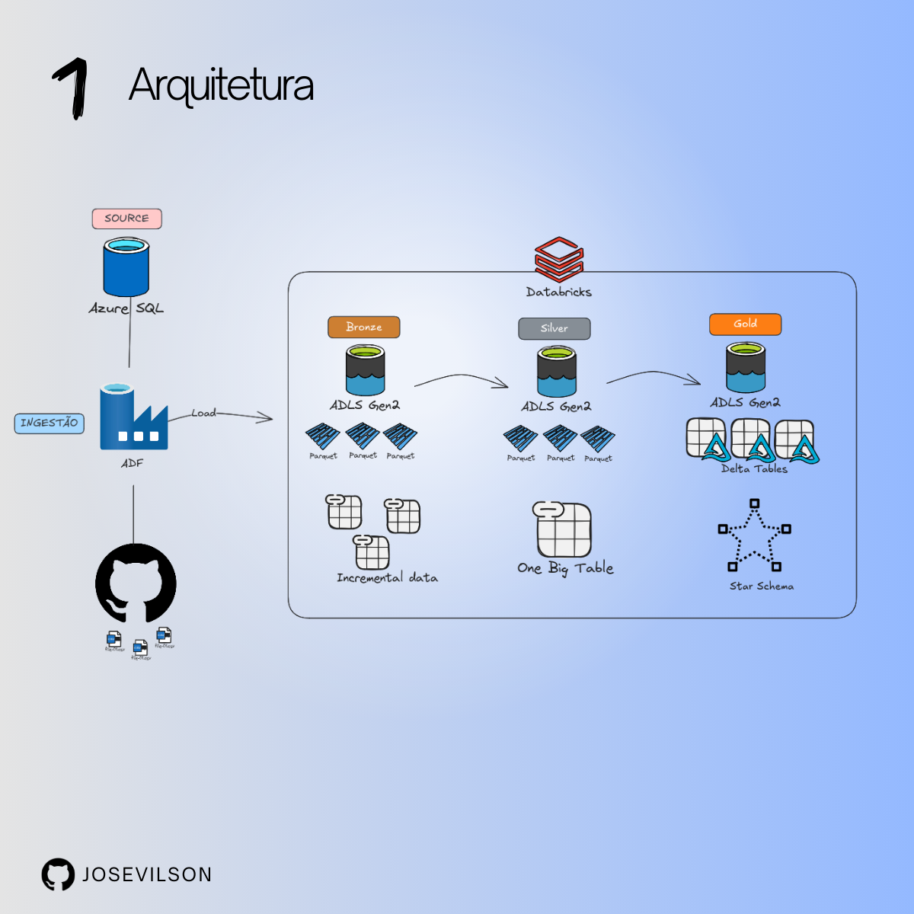
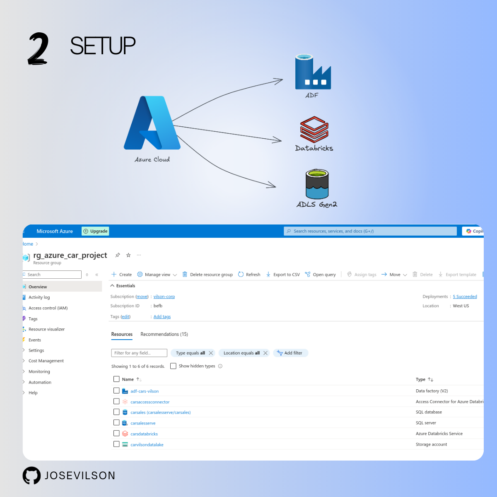
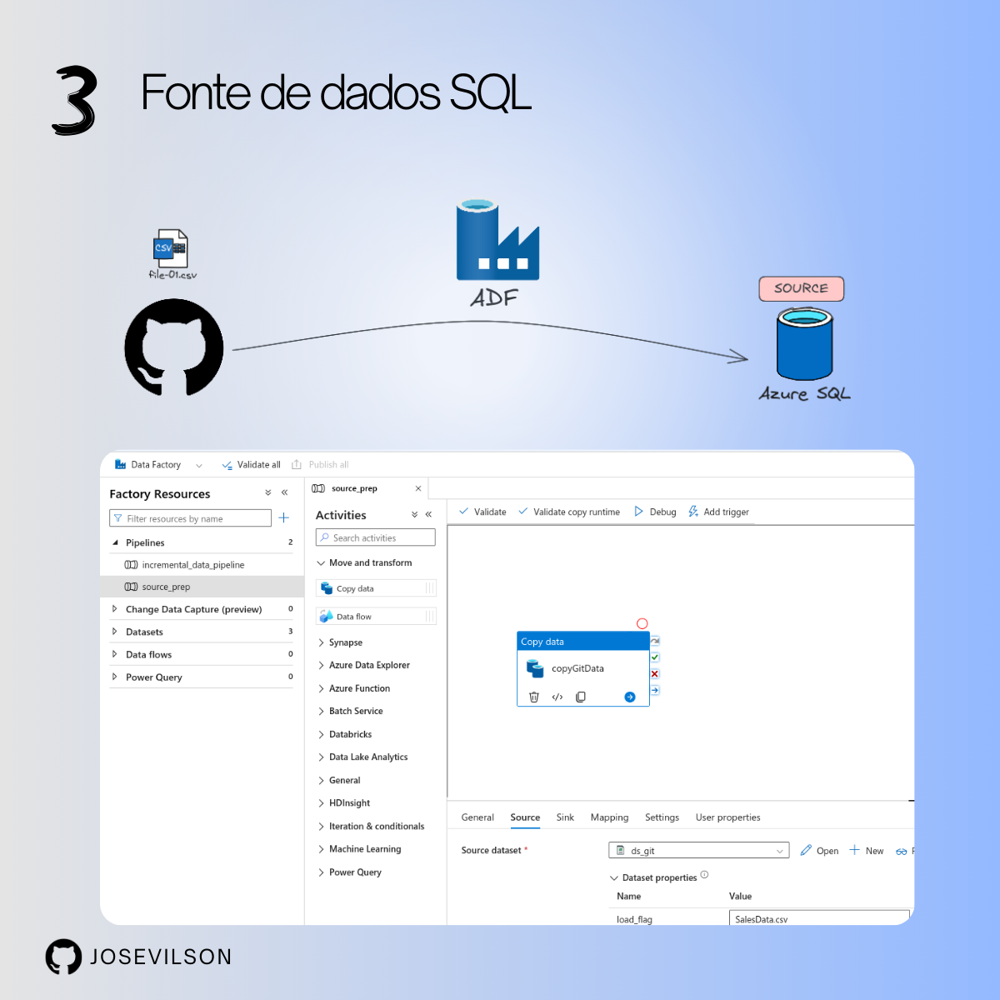
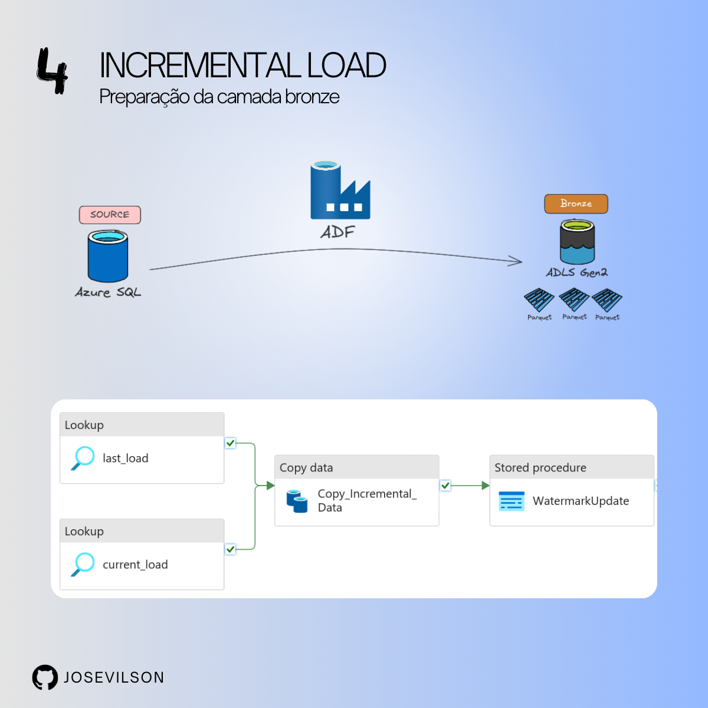
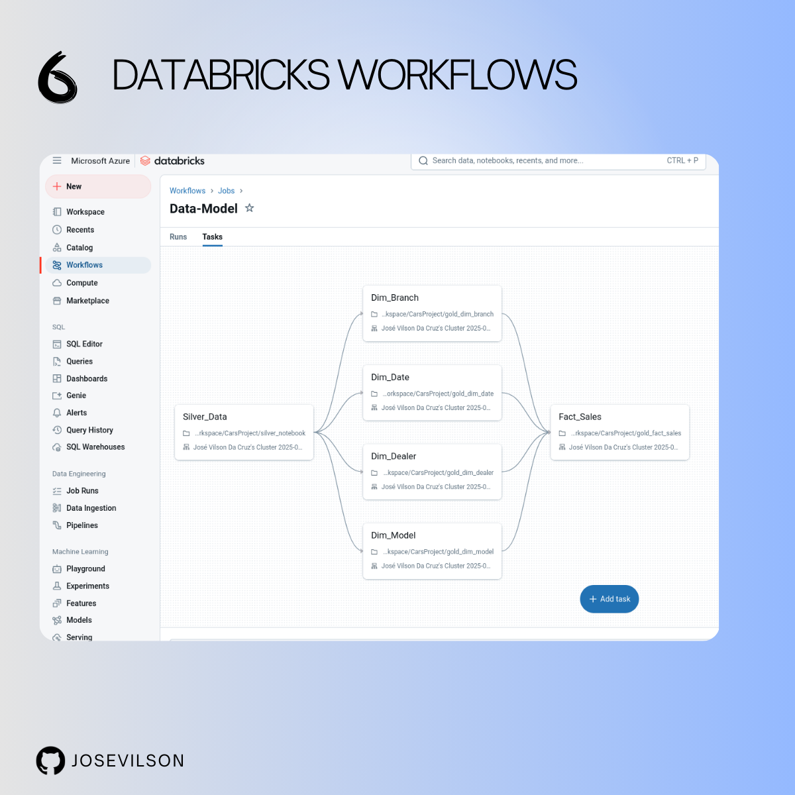

# Engenharia de Dados no Cloud Azure: Um Projeto End-to-End 🚀

Feliz demais em finalizar este projeto aplicando as melhores práticas de engenharia de dados. Utilizamos o Azure Data Factory (ADF) para a ingestão de dados na camada Bronze e o Databricks + Delta Lake para a transformação dos dados. Implementamos a técnica Slowly Changing Dimension (SCD) para manter o histórico de mudanças e adotamos o Star Schema como modelagem.

## 🛠 Setup
### Principais estruturas do projeto:
✅ Azure Databricks  
✅ Azure Data Factory  
✅ Azure Data Lake Storage Gen2  

## 🔹 Arquitetura!

## 🔹 Principais Práticas do Projeto
### Arquitetura Medallion (Bronze, Prata e Ouro)

Organização dos dados em camadas para garantir maior governança e qualidade dos dados:
- **Camada Bronze**: Dados brutos ingeridos pelo Azure Data Factory.
- **Camada Prata**: Transformação e limpeza de dados no Azure Databricks.
- **Camada Ouro (Gold)**: Dados prontos para consumo analítico, armazenados em Delta Lake, garantindo transações ACID e versionamento.

### Ingestão e Transformação de Dados
✅ Uso do **Azure Data Factory** para extração de dados e carregamento no Data Lake.  
✅ Processamento no **Azure Databricks com PySpark** para transformação dos dados.

### 🔹 Modelagem e Disponibilização

📂 **Incremental Data** - Processamento de dados de forma incremental para eficiência e escalabilidade.  
📊 **One Big Table (OBT)** - Estratégia de otimização para consultas de alto desempenho.  
🧩 **Modelagem de Dados** - Implementação de **Slowly Changing Dimension (SCD)** para histórico de mudanças e **Star Schema** para modelagem analítica.

### 🔹 Orquestração
✅ **Databricks Workflow** - Automatização e gerenciamento dos pipelines de dados.

## 📌 Tecnologias Utilizadas
- **Azure Databricks** (PySpark, Delta Lake)
- **Azure Data Factory**
- **Azure Data Lake Storage Gen2**
- **SQL para consultas e modelagem**

## 🔗 Tags
#DataEngineering #Azure #BigData #Databricks #SQL #ETL #PySpark #DataLake #DataFactory

---
🚀 **Engenharia de Dados no Cloud Azure: Transformando dados em insights!**

